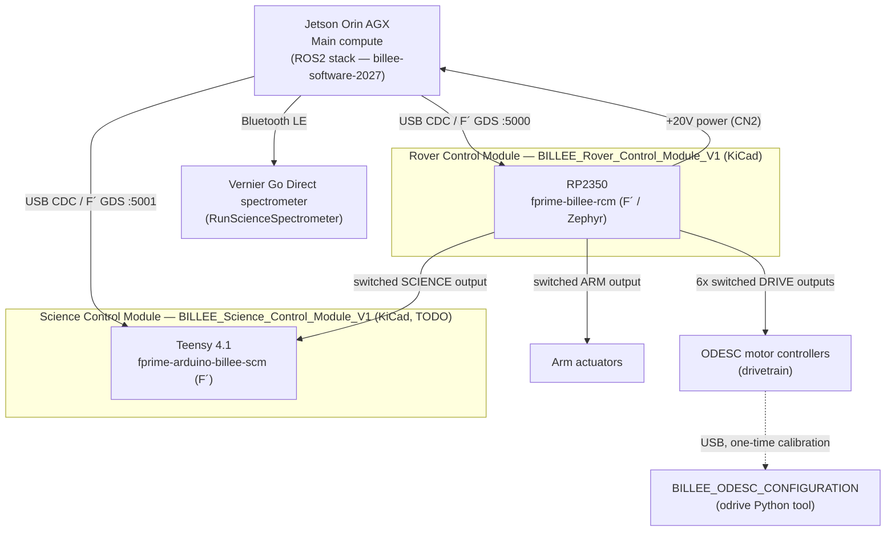
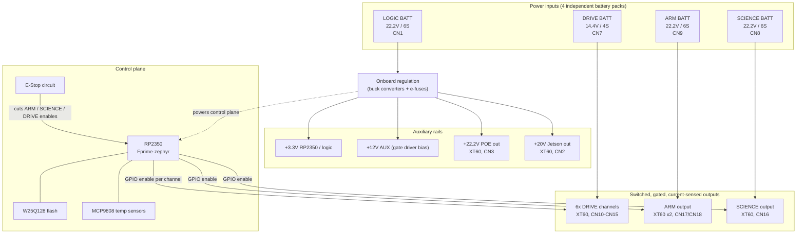
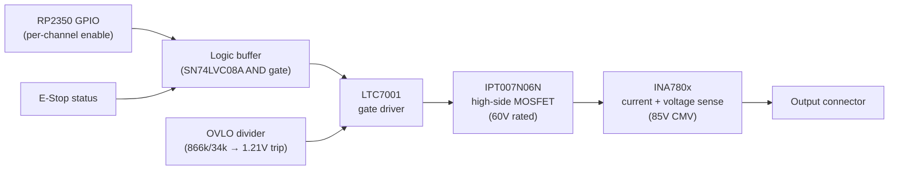

# BILLEE Hardware 2027
### By Luca Lanzillotta

This repository contains the hardware design and simulation files for the BILLEE Rover Control Module, schematic diagrams for the Science Control Module, F´/Zephyr firmware, Science Arduino firmware, and all supporting resources required to operate BILLEE for URC 2027.
If you are looking for our ROS2 Humble Software Stack, refer to [billee-software-2027](https://github.com/BroncoSpace-BILLEE/URC-2027).

## Table of contents

- [Repository layout](#repository-layout)
- [System architecture](#system-architecture)
- [BILLEE Rover Control Module PCB](#billee-rover-control-module-pcb)
  - [System overview](#system-overview)
  - [Power architecture](#power-architecture)
  - [Per-channel protection chain](#per-channel-protection-chain)
  - [Subsystems](#subsystems)
  - [Connectors](#connectors)
  - [RCM Firmware](#rcm-firmware)
- [BILLEE Science Control Module Schematic](#billee-science-control-module-schematic)
  - [SCM Firmware](#scm-firmware)
- [Drivetrain motor calibration — ODESC Configuration](#drivetrain-motor-calibration--odesc-configuration)
- [Science spectrometer tooling](#science-spectrometer-tooling)
- [Getting started](#getting-started)
- [Design status](#design-status)
- [Contributors](#contributors)

## Repository layout

```
billee-hardware-2027/
├── BILLEE_Rover_Control_Module_V1/       # KiCad project for the RCM board (this board)
├── BILLEE_Science_Control_Module_V1/     # TODO — placeholder, KiCad project not yet started
├── BILLEE_ODESC_CONFIGURATION/           # Python tool: USB ODESC motor calibration
├── RunScienceSpectrometer/               # Offline Vernier spectrometer PWA + kiosk setup for the Jetson
├── fprime-billee-rcm/                    # F´ firmware for the RCM board (git submodule)
└── fprime-arduino-billee-scm/            # F´ firmware for the Science Control Module (git submodule)
```

## System architecture

BILLEE's compute and control hardware breaks down into a Jetson Orin AGX main
compute module, the Rover Control Module (RCM, this repo's primary board),
the Science Control Module (SCM), and the drivetrain's ODESC motor
controllers. The RCM both powers the Jetson and exchanges F´ telemetry/
commands with it; the SCM and the Jetson each run their own F´ deployment,
talking over separate USB connections and separate GDS dashboard ports so
both can be open at once.



Solid arrows are runtime power/data paths; the dashed arrow is the ODESC
calibration tool's occasional USB connection, not part of the running
topology. Runtime drivetrain/arm motor commands come from the ROS2 stack in
[billee-software-2027](https://github.com/BroncoSpace-BILLEE/URC-2027), outside
this repo's scope — the RCM only switches and protects their power.

### Hardware ↔ Firmware

| Hardware (KiCad project) | Firmware | Target | Role |
|---|---|---|---|
| [`BILLEE_Rover_Control_Module_V1/`](BILLEE_Rover_Control_Module_V1/) | [`fprime-billee-rcm`](fprime-billee-rcm/README.md) | RP2350 (F´ / Zephyr) | Power distribution/gating for DRIVE, ARM, and SCIENCE; powers the Jetson; reports subsystem/E-Stop/thermal telemetry over USB |
| [`BILLEE_Science_Control_Module_V1/`](BILLEE_Science_Control_Module_V1/) — **TODO** | [`fprime-arduino-billee-scm`](fprime-arduino-billee-scm/README.md) | Teensy 4.1 (F´) | Science instrument control, USB CDC to Jetson |
| *(ODESC motor controllers — third-party hardware, not a KiCad project here)* | [`BILLEE_ODESC_CONFIGURATION`](BILLEE_ODESC_CONFIGURATION/README.md) | ODrive-based ODESC | One-time/occasional USB calibration tool (encoder/motor cal, CAN node ID) — not runtime firmware |

BILLEE is a Mars-rover-style rover platform built as a university project. This repository holds the hardware for the **Rover Control Module (RCM)** — the rover's central power distribution and control board. It takes in power from up to four independent battery packs, gates and protects eight switched high-current outputs (six drivetrain channels plus dedicated ARM and SCIENCE subsystem outputs), and hosts the RP2350 microcontroller that supervises the whole board, running [NASA JPL's F´ (F Prime)](https://fprime.jpl.nasa.gov/) flight software framework on Zephyr RTOS.

## BILLEE Rover Control Module PCB


## System overview



## Power architecture

Every high-current output is switched, not just fused — each channel has its own MOSFET high-side switch, gate driver, and current/voltage sense IC, controlled by the RP2350 and independently protected against overvoltage.

| Input | Voltage | Pack | Connector | Feeds |
|---|---|---|---|---|
| LOGIC | 22.2V nominal | 6S | CN1 (XT90) | Onboard regulation → 3.3V logic, 12V gate-driver bias, POE out, Jetson out |
| DRIVE | 14.4V nominal | 4S | CN7 (XT90) | 6x independently gated drivetrain outputs |
| ARM | 22.2V nominal | 6S | CN9 (XT90) | ARM actuator output (dedicated, not shared with LOGIC) |
| SCIENCE | 22.2V nominal | 6S | CN8 (XT90) | SCIENCE payload output (dedicated, not shared with LOGIC) |

ARM and SCIENCE each have their own battery input rather than sharing the LOGIC bus — this keeps their (higher-current, motor-driven) load switching electrically isolated from the board's own logic supply.

## Per-channel protection chain

The same signal chain protects all eight switched outputs (six DRIVE channels, ARM, SCIENCE) — this is what sits between the RP2350's enable GPIO and the actual output connector:



Each channel's overvoltage lockout trips at roughly the same ~32V threshold regardless of that channel's nominal rail — set by a fixed 866kΩ/34kΩ divider into the gate driver's 1.21V comparator reference. The MOSFETs and current-sense amplifiers were selected with wide margin above every rail on this board (60V and 85V ratings against a top end around 25V), so the same switch/sense stage is reused across the 14.4V DRIVE channels and the 22.2V ARM/SCIENCE channels without modification.

## Subsystems

| Subsystem | Sheet | What's there |
|---|---|---|
| RP2350A | `mcurp2350.kicad_sch` | RP2350 MCU, crystal, QSPI flash, USB-C, SWD debug header, GPIO breakout |
| Logic Subsystem | `power.kicad_sch` | Buck regulators, e-fuses, logic/auxiliary rail generation |
| Subsystem Power Control | `estop.kicad_sch` | E-stop circuit, all 8 gate-driver/switch/sense channels, OVLO dividers |

## Connectors

| Ref | Part | Count | Purpose |
|---|---|---|---|
| CN1 | XT90PW | 1 | LOGIC battery input (22.2V) |
| CN7 | XT90PW | 1 | DRIVE battery input (14.4V) |
| CN8 | XT90PW | 1 | SCIENCE battery input (22.2V) |
| CN9 | XT90PW | 1 | ARM battery input (22.2V) |
| CN10–CN15 | XT60PW | 6 | DRIVE channel outputs 1–6 |
| CN16 | XT60PW | 1 | SCIENCE output |
| CN17, CN18 | XT60PW | 2 | ARM output |
| CN2 | XT60PW | 1 | Jetson power output (+20V) |
| CN3 | XT60PW | 1 | POE output (+22.2V) |
| CN4, CN5 | XT60PW | 2 | Auxiliary +12V outputs |
| CN6 | DF11-18DP | 1 | RP2350 GPIO breakout (9 GPIO + ADC0/1 + power/GND) |
| USB1 | USB-C | 1 | RP2350 USB |
| J1 | 2.54mm header | 1 | SWD debug (SWCLK/SWD/GND) |

## RCM Firmware

The RCM's RP2350 runs [F´](https://fprime.jpl.nasa.gov/) on Zephyr RTOS —
subsystem power enable/disable, E-Stop handling, and MCP9808/INA780B thermal
and power telemetry, communicating with the Jetson over USB CDC. To get
started:

```bash
cd fprime-billee-rcm
make setup      # creates fprime-venv, inits submodules, installs requirements.txt
```

See [`fprime-billee-rcm/README.md`](fprime-billee-rcm/README.md) for the rest
(`make setup-zephyr`, `make build-rp2350`, flashing, GDS), and
[`docs/OPERATOR_MANUAL.md`](fprime-billee-rcm/docs/OPERATOR_MANUAL.md) for the
command/telemetry reference.

## BILLEE Science Control Module Schematic

**TODO** — [`BILLEE_Science_Control_Module_V1/`](BILLEE_Science_Control_Module_V1/)
is an early-stage KiCad project; this section will be filled in with the
schematic and hardware documentation once the board design is integrated.

## SCM Firmware

The SCM runs F´ on a Teensy 4.1, communicating with the Jetson over its own
USB CDC connection (GDS on port 5001, alongside the RCM's on port 5000). To
get started:

```bash
cd fprime-arduino-billee-scm
make setup      # creates fprime-venv, inits submodules, installs Python deps
```

See [`fprime-arduino-billee-scm/README.md`](fprime-arduino-billee-scm/README.md)
for the rest (`make setup-arduino`, `make generate`, `make build`, flashing).

## Drivetrain motor calibration — ODESC Configuration

[`BILLEE_ODESC_CONFIGURATION`](BILLEE_ODESC_CONFIGURATION/README.md) is a
Python tool (not firmware) for calibrating an ODESC-controlled drivetrain
motor over USB — encoder/motor calibration, CAN node ID setup, and saving
config to flash. It's a one-time/occasional setup step per motor, separate
from runtime motor control.

## Science spectrometer tooling

[`RunScienceSpectrometer`](RunScienceSpectrometer/README.md) sets up an
offline-capable copy of Vernier's Spectral Analysis PWA on the Jetson, talking
to a Go Direct spectrometer over Bluetooth LE, with an optional headless
VNC kiosk mode.

## Getting started

1. Clone with submodules — the F´ component library is a separate repo:
   ```
   git clone --recurse-submodules https://github.com/BroncoSpace-BILLEE/billee-hardware-2027.git
   ```
   Already cloned, or need to resync after a branch change? Run `make rover` from
   the repo root — it checks out `lucadev`, pulls, and updates every submodule
   recursively. `make help` lists all targets.
2. Open `BILLEE_Rover_Control_Module_V1/BILLEE_Rover_Control_Module_V1.kicad_pro` in KiCad. The custom library footprints under `lib/` are wired up via the project's `fp-lib-table`/`sym-lib-table` — no extra setup needed.
3. To order the board: everything JLCPCB needs is pre-generated in `BILLEE_Rover_Control_Module_V1/jlcpcb/production_files/` — `BOM-*.csv`, `CPL-*.csv`, and `GERBER-*.zip`. If you change the design, regenerate these (via the KiCad JLCPCB/Fabrication-Toolkit plugin) before ordering — the production files are a separate export step from the schematic/PCB and don't update automatically.
4. Firmware for the RCM runs [F´](https://fprime.jpl.nasa.gov/) on Zephyr; the board-specific F´ components live in the `fprime-billee-rcm` submodule.
5. To calibrate a drivetrain motor's ODESC, see [`BILLEE_ODESC_CONFIGURATION/README.md`](BILLEE_ODESC_CONFIGURATION/README.md).
6. To set up the science spectrometer on the Jetson, run `make science` from the repo root, or see [`RunScienceSpectrometer/README.md`](RunScienceSpectrometer/README.md).

## Design status

This board has been through multiple engineering review passes covering bare-fabrication geometry (clearances, hole spacing, via annular ring, zone integrity, board outline), full-board net connectivity, BOM/CPL/Gerber consistency against the actual sourced parts, and datasheet-checked voltage/current margin on every switched-power component. As of the current `main`, it's been reviewed and cleared to order.

## Contributors

- Luca Lanzi ([@LucaLanzi](https://github.com/LucaLanzi))
- Jason Suarez ([@Plush-Jason](https://github.com/Plush-Jason))
